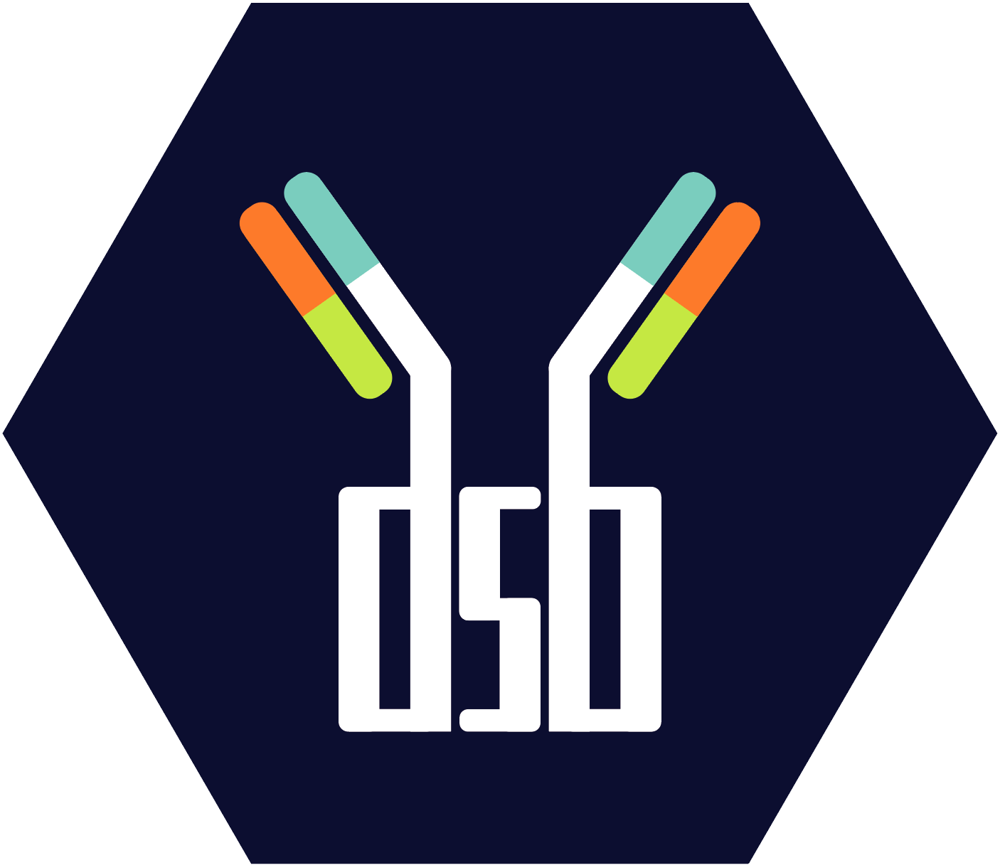

<!-- badges: start -->
[](https://CRAN.R-project.org/package=dsb)
<!-- badges: end -->

#### <strong> <a href='https://mattpm.github.io/dsb/'></a>  dsb: a method for normalizing and denoising antibody derived tag data from CITE-seq, ASAP-seq, TEA-seq and related assays. </strong>

```{r, include = FALSE}
library(here)
knitr::opts_chunk$set(
  #tidy = TRUE,
  #tidy.opts = list(width.cutoff = 95),
  warning = FALSE, 
  eval = FALSE,
  root.dir = here()
)
```

The dsb R package is available on [**CRAN: latest dsb release**](https://CRAN.R-project.org/package=dsb)  
to install in R: `install.packages('dsb')`  

#### Vignettes:  
[**Using dsb in an end to end CITE-seq workflow including WNN clustering**](https://cran.rstudio.com/web/packages/dsb/vignettes/end_to_end_workflow.html)  
[**How the dsb method works**](https://cran.rstudio.com/web/packages/dsb/vignettes/understanding_dsb.html)  
[**Normalizing ADTs if empty drops are not available**](https://cran.rstudio.com/web/packages/dsb/vignettes/no_empty_drops.html)  
[**FAQ etc.**](https://cran.r-project.org/web/packages/dsb/vignettes/additional_topics.html)  

dsb is also available for *Python* with muon:  
[**muon documentation**](https://muon.readthedocs.io/en/latest/omics/citeseq.html)  

Please cite the dsb manuscript if you used our software or found the experimental and modeling derivation of ADT noise sources in our paper helpful:  
[**dsb manuscript**](https://www.biorxiv.org/content/10.1101/2020.02.24.963603v3)  

See news.md for updates.  
[**news.md**](https://github.com/niaid/dsb/blob/master/NEWS.md)  
