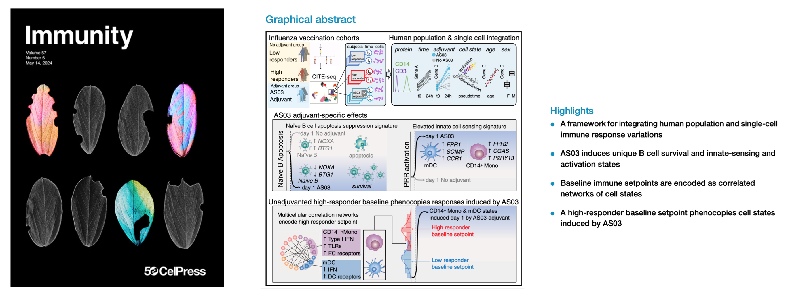
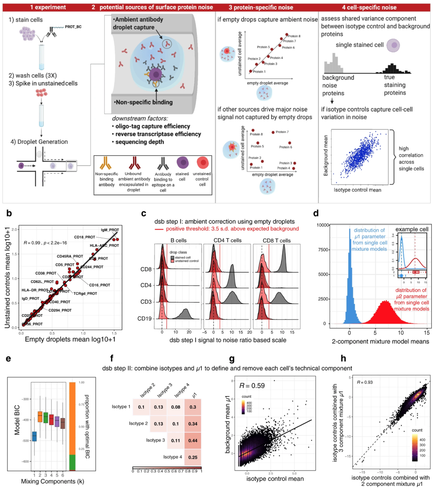
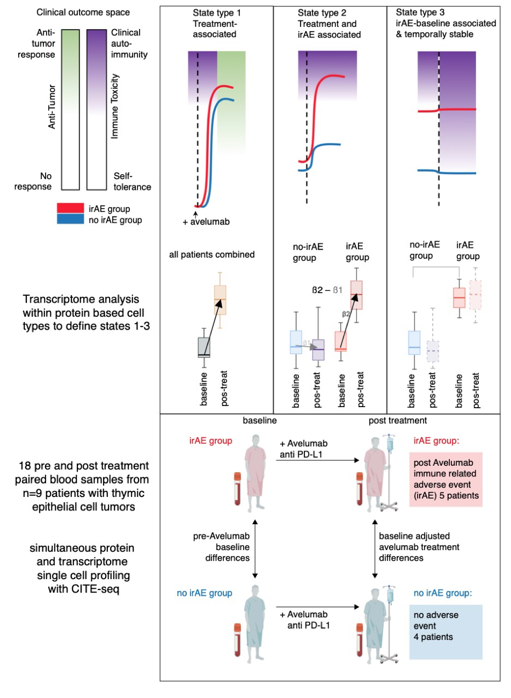

 

**Matt Mulè PhD**

 
 

Human immune systems are sensory systems shaped by the individual's development and the environment, much like the brain. They are thus markedly variable between even genetically identical individuals. 

During my PhD at Cambridge and NIH, with [John Tsang (NIH)](https://medicine.yale.edu/profile/john-tsang/?tab=bio) and [Ken Smith (Cambridge)](https://www.wehi.edu.au/researcher/ken-smith/), I focused on advancing the concept of identifying and measuring homeostatic human immune system "setpoints"; baseline states that, along with dynamic immune responses, predict outcomes to vaccination, infection, and cancer immunotherapy. 

My work uses systems immunology approaches to conceptualize the immune system as a communication network. By developing analysis methods for modern profiling tools, we define how all the cell subsets comprising the immune system communicate to "wire" these homeostatic setpoints and response states. 

On the technical side, I develop open-source tools to address assay noise and implement mixed effects models and network analysis to tackle datasets with complex nesting structures. The software tools I develop enable the incorporation and integration of human population variations into statistical inferences crucial for understanding human immune variation. 

Currently, my research has a dual focus using systems immunology approaches to: 
1. Understand human immune system variation across diverse pathologies. 
2. Develop molecular diagnostic tools based on these multicell networks for the clinical immunology laboratory. 

 

**Selected work**

 

#### [**Integrating population and single-cell variations in vaccine responses identifies a naturally adjuvanted human immune setpoint**](/man/pdf/MPM_immunity_2024.pdf)  
**Immunity (2024)**
Multimodal single-cell profiling methods can capture immune cell variations unfolding over time at the molecular, cellular, and population levels. Transforming these data into biological insights remains challenging. Here, we introduce a framework to integrate variations at the human population and single-cell levels in vaccination responses. Comparing responses following AS03-adjuvanted versus unadjuvanted influenza vaccines with CITE-seq revealed AS03-specific early (day 1) response phenotypes, including a B cell signature of elevated germinal center competition. A correlated network of cell-type-specific transcriptional states defined the baseline immune status associated with high antibody responders to the unadjuvanted vaccine. Certain innate subsets in the network appeared ‘‘naturally adjuvanted,’’ with transcriptional states resembling those induced uniquely by AS03-adjuvanted vaccination. Consistently, CD14+ monocytes from high responders at baseline had elevated phospho-signaling responses to lipopolysaccharide stimulation. Our findings link baseline immune setpoints to early vaccine responses, with positive implications for adjuvant development and immune response engineering.

  <a href="/man/pdf/natural_adjuvant_immunity_2024.pdf">
    <button>PDF</button>
  </a>
  <a href="https://niaid.github.io/fsc/">
    <button> code</button>
  </a>
  <a href="https:/doi.org/10.1016/j.immuni.2024.04.009">
    <button>DOI</button>
  </a>
    <a href="/man/pdf/immunity_2024_editorial.pdf">
    <button>Editorial coverage</button>
  </a>
    <a href="https://twitter.com/MPMule/status/1790479570979672126">
    <button>cover art</button>
  </a>

 

 

 
 

#### [**Normalizing and denoising protein expression data from droplet-based single cell profiling**](https://www.nature.com/articles/s41467-022-29356-8)  
**Nature Communications (2022)**
Multimodal single-cell profiling methods that measure protein expression with oligo-conjugated antibodies hold promise for comprehensive dissection of cellular heterogeneity, yet the resulting protein counts have substantial technical noise that can mask biological variations. Here we integrate experiments and computational analyses to reveal two major noise sources and develop a method called “dsb” (denoised and scaled by background) to normalize and denoise droplet-based protein expression data. We discover that protein-specific noise originates from unbound antibodies encapsulated during droplet generation; this noise can thus be accurately estimated and corrected by utilizing protein levels in empty droplets. We also find that isotype control antibodies and the background protein population average in each cell exhibit significant correlations across single cells, we thus use their shared variance to correct for cell-to-cell technical noise in each cell. We validate these findings by analyzing the performance of dsb in eight independent datasets spanning multiple technologies, including CITE-seq, ASAP-seq, and TEA-seq. Compared to existing normalization methods, our approach improves downstream analyses by better unmasking biologically meaningful cell populations. Our method is available as an open-source R package that interfaces easily with existing single cell software platforms such as Seurat, Bioconductor, and Scanpy and can be accessed at “dsb [https://cran.r-project.org/package=dsb]”.

  <a href="/man/pdf/dsb_paper_2022.pdf">
    <button>PDF</button>
  </a>
  <a href="https://github.com/niaid/dsb_manuscript">
    <button> code</button> 
  </a>
  <a href="https://www.nature.com/articles/s41467-022-29356-8">
    <button>DOI</button>
  </a>
  <a href="https://CRAN.R-project.org/package=dsb">
    <button>R Package</button>
  </a>

 
 
 

  

#### [**Contrasting autoimmune and treatment effects reveals baseline set points of immune toxicity following checkpoint inhibitor treatment**](https://www.biorxiv.org/content/10.1101/2022.06.05.494592v1) 
**BioRxiv (2022)**
Immune checkpoint inhibitors (ICIs) have changed the cancer treatment landscape, but severe immune-related adverse events (irAEs) can trigger life-threatening autoimmunity or treatment discontinuation. Uncovering immune phenotypes associated specifically with irAEs but not antitumor immunity could help mitigate treatment discontinuation and improve clinical outcomes. We carried out simultaneous transcriptome and surface protein profiling of blood immune cells from thymic cancer patients before and after treatment with the anti-PD-L1 antibody avelumab. All patients had antitumor responses, yet a subset developed severe myositis. We developed an analytical framework to disentangle phenotypes linked to treatment responses versus irAEs. Our approach identified a temporally stable, pre-treatment immune set point associated with irAEs, but not anti-tumor effects, consisting of correlated innate and adaptive cell phenotypes. These phenotypes included potentially actionable genes downstream of mTOR in T-cell subsets. Elevated expression of gene signatures reflecting this irAE-associated setpoint at baseline in other types of cancer predicted the development of irAEs after treatment with different checkpoint inhibitors. Together our findings indicate a generalizable baseline immune setpoint linked to the development of irAEs after ICI treatment and raise the prospect of therapeutically dampening autoimmunity while sparing antitumor activity in the setting of checkpoint inhibition.
 

  <a href="https://www.biorxiv.org/content/10.1101/2022.06.05.494592v1">
    <button>PDF</button>
  </a>
  <a href="https://github.com/niaid/irae_manuscript">
    <button> code </button>
  </a>
  <a href="https://www.biorxiv.org/content/10.1101/2022.06.05.494592v1">
    <button>DOI</button>
  </a>

 
