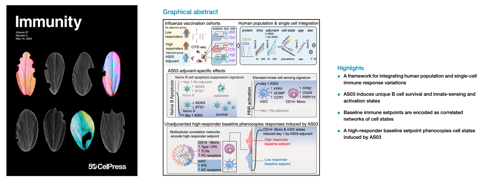
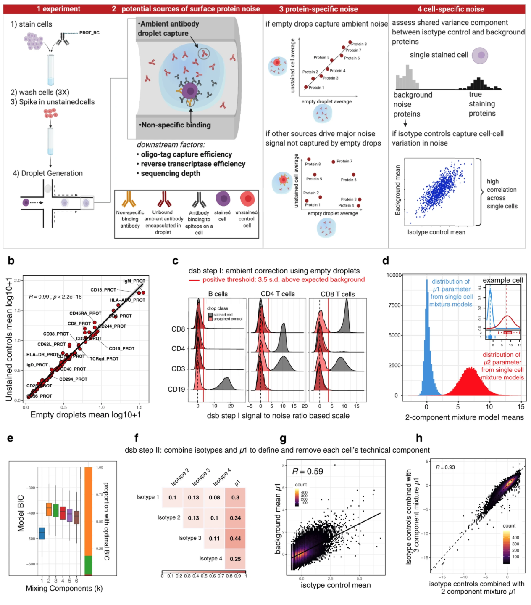
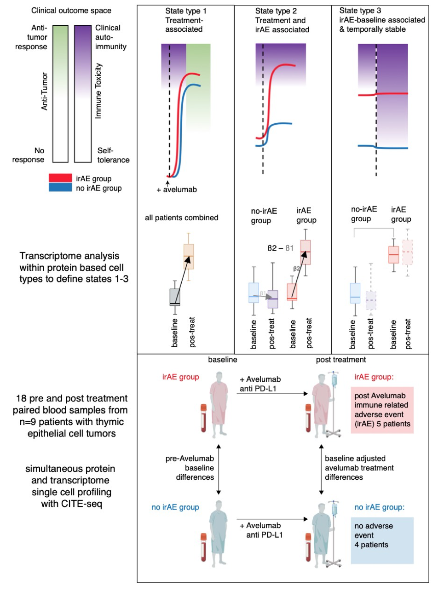

 

**Matt Mulè PhD**

 
 

How can we improve clinical outcomes for patients by understanding and measuring the global state of their immune system? I focused on developing the concept of homeostatic human immune system "setpoints" and later immune response dynamics that predict vaccination, infection, and cancer immunotherapy outcomes in my PhD at Cambridge and NIH with [John Tsang (NIH)](https://medicine.yale.edu/profile/john-tsang/?tab=bio) and [Ken Smith (Cambridge)](https://www.wehi.edu.au/researcher/ken-smith/). Setpoints and response states are formed by molecular networks of information shared between immune cell subsets. We can now measure these networks with high dimensional immune cell profiling in humans, including combined surface protein and transcriptome measurement in single cells. On the methodological side, I focused on understanding sources of noise in these methods and developed open source software for normalization / denoising / human cohort analysis. 

<u>I'm currently focused on advancing the field of personalized clinical immunology on two fronts: </u> 
 
1. Investigating how molecular networks define human immune variation with a goal of defining immune system "subtypes" that predict clinical responses to cancer immunotherapy, vaccination, and treatment of immune mediated/inflammatory disease. 
 
 
2. Developing personalized therapeutic strategies for patients informed by low-cost global immune system diagnostic tests that can be implemented in the clinical immunology laboratory. 

 

**Selected work**

 

#### [**Integrating population and single-cell variations in vaccine responses identifies a naturally adjuvanted human immune setpoint**](/man/pdf/MPM_immunity_2024.pdf)  
**Immunity (2024)**
Multimodal single-cell profiling methods can capture immune cell variations unfolding over time at the molecular, cellular, and population levels. Transforming these data into biological insights remains challenging. Here, we introduce a framework to integrate variations at the human population and single-cell levels in vaccination responses. Comparing responses following AS03-adjuvanted versus unadjuvanted influenza vaccines with CITE-seq revealed AS03-specific early (day 1) response phenotypes, including a B cell signature of elevated germinal center competition. A correlated network of cell-type-specific transcriptional states defined the baseline immune status associated with high antibody responders to the unadjuvanted vaccine. Certain innate subsets in the network appeared ‘‘naturally adjuvanted,’’ with transcriptional states resembling those induced uniquely by AS03-adjuvanted vaccination. Consistently, CD14+ monocytes from high responders at baseline had elevated phospho-signaling responses to lipopolysaccharide stimulation. Our findings link baseline immune setpoints to early vaccine responses, with positive implications for adjuvant development and immune response engineering.

  <a href="/man/pdf/natural_adjuvant_immunity_2024.pdf">
    <button>PDF</button>
  </a>
  <a href="https://niaid.github.io/fsc/">
    <button> code </button>
  </a>
  <a href="https:/doi.org/10.1016/j.immuni.2024.04.009">
    <button>DOI</button>
  </a>
    <a href="/man/pdf/immunity_2024_editorial.pdf">
    <button>Editorial coverage</button>
  </a>
    <a href="https://twitter.com/MPMule/status/1790479570979672126">
    <button>cover art</button>
  </a>

 

 

 
 
 

#### [**Normalizing and denoising protein expression data from droplet-based single cell profiling**](https://www.nature.com/articles/s41467-022-29356-8)  
**Nature Communications (2022)**
Multimodal single-cell profiling methods that measure protein expression with oligo-conjugated antibodies hold promise for comprehensive dissection of cellular heterogeneity, yet the resulting protein counts have substantial technical noise that can mask biological variations. Here we integrate experiments and computational analyses to reveal two major noise sources and develop a method called “dsb” (denoised and scaled by background) to normalize and denoise droplet-based protein expression data. We discover that protein-specific noise originates from unbound antibodies encapsulated during droplet generation; this noise can thus be accurately estimated and corrected by utilizing protein levels in empty droplets. We also find that isotype control antibodies and the background protein population average in each cell exhibit significant correlations across single cells, we thus use their shared variance to correct for cell-to-cell technical noise in each cell. We validate these findings by analyzing the performance of dsb in eight independent datasets spanning multiple technologies, including CITE-seq, ASAP-seq, and TEA-seq. Compared to existing normalization methods, our approach improves downstream analyses by better unmasking biologically meaningful cell populations. Our method is available as an open-source R package that interfaces easily with existing single cell software platforms such as Seurat, Bioconductor, and Scanpy and can be accessed at “dsb [https://cran.r-project.org/package=dsb]”.

  <a href="/man/pdf/dsb_paper_2022.pdf">
    <button>PDF</button>
  </a>
  <a href="https://github.com/niaid/dsb_manuscript">
    <button> code </button>
  </a>
  <a href="https://www.nature.com/articles/s41467-022-29356-8">
    <button>DOI</button>
  </a>
  <a href="https://CRAN.R-project.org/package=dsb">
    <button>R Package</button>
  </a>

 
 
 

  

#### [**Contrasting autoimmune and treatment effects reveals baseline set points of immune toxicity following checkpoint inhibitor treatment**](https://www.biorxiv.org/content/10.1101/2022.06.05.494592v1) 
**BioRxiv (2022)**
Immune checkpoint inhibitors (ICIs) have changed the cancer treatment landscape, but severe immune-related adverse events (irAEs) can be life-threatening or fatal and may prohibit patients from receiving further ICI treatment. While the clinical features of irAEs are well documented, molecular signatures, predictive biomarkers, and mechanisms of impending irAEs are largely unknown. In addition, the markers and mechanisms of ICI-induced antitumor immunity often overlap with those for irAEs. It is thus critical to uncover signatures associated specifically with irAEs but not with antitumor immunity. To identify circulating immune cell states associated with irAEs, we applied multimodal single cell analysis (CITE-seq) to simultaneously measure the transcriptome and surface proteins from peripheral blood mononuclear cells (PBMCs) collected before and after treatment with an anti-PD-L1 antibody (avelumab) in patients with thymic cancers (thymic epithelial tumors). All patients had an antitumor response, yet a subset developed muscle autoimmunity (myositis), a potentially life-threatening irAE. Mixed-effect modeling disentangled cell type-specific transcriptional states associated with ICI treatment responses from those of irAEs to identify temporally stable pre-treatment immune set points associated with irAEs only. These pre-treatment baseline signatures of irAE developed post-avelumab irAEs reflect correlated transcriptional states of multiple innate and adaptive immune cell populations, including elevation of metabolic genes downstream of mTOR signaling in T-cell subsets. Together these findings suggest putative pre-treatment biomarkers for irAEs following ICI therapy in thymic cancer patients and raise the prospect of therapeutically dampening autoimmunity while sparing antitumor activity in cancer patients treated with ICIs. Together, pre-treatment biomarkers and interventional therapeutics could help mitigate treatment discontinuation and improve clinical outcomes.  

  <a href="https://www.biorxiv.org/content/10.1101/2022.06.05.494592v1">
    <button>PDF</button>
  </a>
  <a href="https://github.com/niaid/irae_manuscript">
    <button> code </button>
  </a>
  <a href="https://www.biorxiv.org/content/10.1101/2022.06.05.494592v1">
    <button>DOI</button>
  </a>

 
